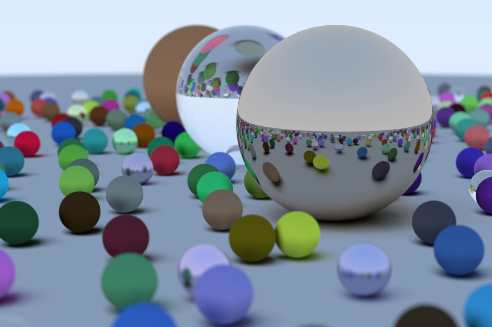

# Intro

Rust version of the [first weekend](https://raytracing.github.io/books/RayTracingInOneWeekend.html) of the Raytracing in one weekend series.

The current state being generated is,

# Building

As any Rust project, just use `cargo build` or the release variant.

# Executing

Just `cargo run` or the release variant, as usual.

A file containing the image, named image.png, will be generated.